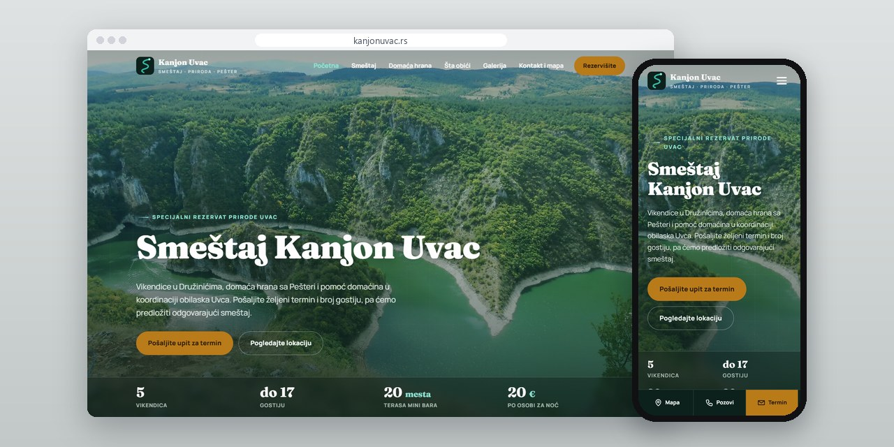
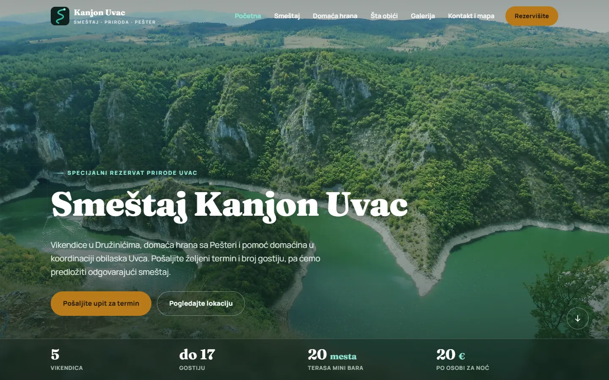
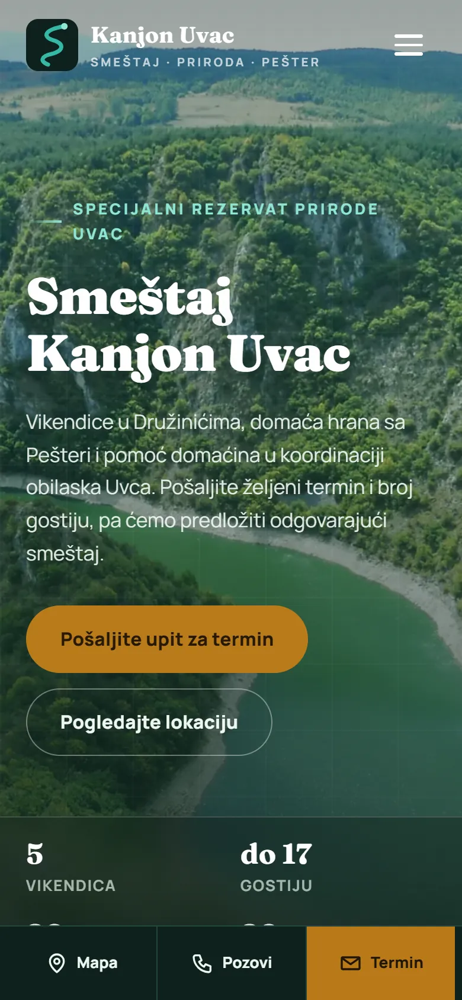
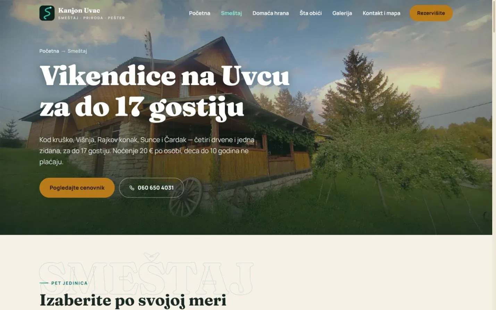
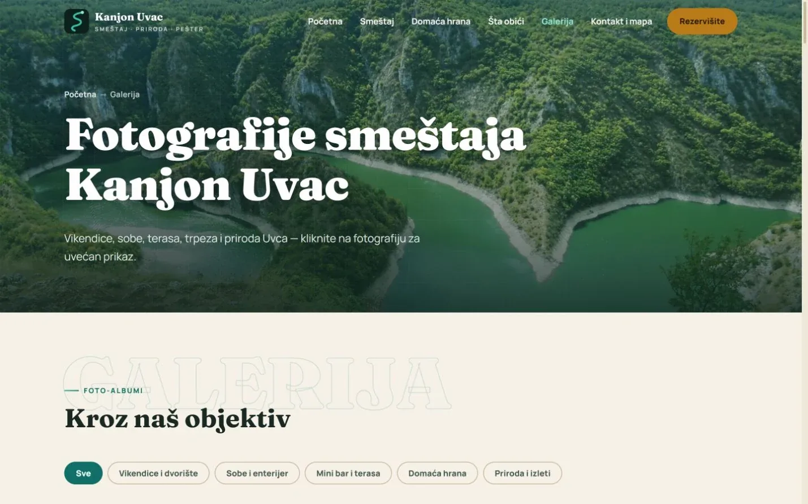

# Kanjon Uvac

Site for five cabins by the Uvac nature reserve: where guests sleep, how they get there and what they can see nearby.

**[kanjonuvac.rs](https://kanjonuvac.rs/)** · [Case study (in Serbian)](https://svilenkovic.com/radovi/kanjon-uvac) · [Srpski](README.sr.md)

> [!NOTE]
> Client project. The source code belongs to the client and stays in a private repository. This page describes what I built and how.

<table>
  <tr><td><b>Client</b></td><td>Kanjon Uvac</td></tr>
  <tr><td><b>Industry</b></td><td>Farm stay with cabins by the Uvac canyon</td></tr>
  <tr><td><b>Location</b></td><td>Družiniće near Sjenica, Serbia</td></tr>
  <tr><td><b>Type</b></td><td>Multi-page website</td></tr>
  <tr><td><b>My role</b></td><td>Design, development, SEO, hosting and maintenance</td></tr>
  <tr><td><b>Stack</b></td><td>HTML, CSS, JavaScript, PHP</td></tr>
</table>

## About the project

Kanjon Uvac is a farm stay in Družiniće, 11 km from Sjenica, with four wooden cabins and one brick one for up to 17 guests, a shared terrace and home-made food from the Pešter plateau. Someone coming to Uvac for the first time needs to know where they will sleep, how to find the place and what there is to see. The site ties the cabins, the food, the map and the trips together.

The farm is outside any street grid, so arrival has its own page with a navigation pin and practical directions rather than a bare address. The interactive map loads only when the visitor presses a button, because that is the moment Google can start processing visit data, and the page says so. The public pages are static HTML, CSS and JavaScript, and only the inquiry form goes through a small PHP script, which keeps the site fast and easy to host or move.

## What I built

- A cabins page with all five units, their beds, bathrooms and capacity, plus the price list
- Separate guides to the canyon, the Molitva viewpoint and boat trips on the Uvac
- Pages for the farm's own food and for group stays
- An inquiry form for dates and number of guests, with a hidden trap field for bots
- Canyon and griffon vulture photos from Wikimedia Commons, credited under their licence, next to the farm's own photos

## Results

| | Performance | Accessibility | Best practices | SEO |
| :-- | :-: | :-: | :-: | :-: |
| Mobile | 95 | 100 | 100 | 100 |
| Desktop | 100 | 100 | 100 | 100 |

PageSpeed Insights, lab test of the live site, September 2026. Security headers: 6 of 6. HTML validator: no errors. axe accessibility check: no violations. Structured data: `LodgingBusiness`.

## Screenshots

<table>
  <tr>
    <td width="68%" valign="top"></td>
    <td width="32%" valign="top"></td>
  </tr>
</table>

An overview of the cottages, with photos and details about the stay

The gallery brings together photos of the cottages and the surrounding area

---

Built by [D. Svilenković](https://svilenkovic.com).
